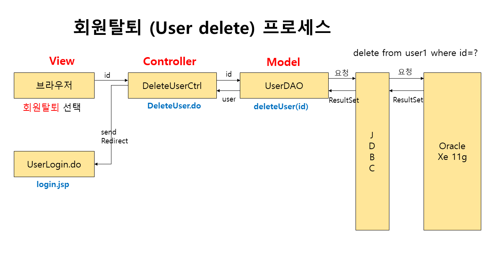

# 프로젝트 개요

### 프로젝트 명 : 가평문화관광
### 프로젝트 기간 : 2023.05.17. ~ 05.31
### 프로젝트 참여 : 전재영
### 자바 버전 : jdk 1.8
### 자바스크립트 버전 : 1.0
### 다이나믹 웹 모듈 : 3.1
### 사용 DBMS : mysql80
### 자바 사용 라이브러리 : json, cos, commons, mail, crypto
### CSS 프레임워크 : 부트스트랩 3.3.2
### 자바스크립트 플러그인 : JQuery
### 자바스크립트 api : daum 주소 api, json 데이터 처리, iamport 결제 api
### 프로젝트 데이터 처리 패턴 : MVC2(View -> Controller -> Model -> Controller -> View)
### 프로젝트 주요 기능 : 회원, 공지사항, 리뷰, Q&A

### 프로젝트 특이 사항
- 회원 가입시 중복 체크는 json을 활용해 별도 팝업 창 없이 현재 창에서 진행
- 회원 가입시 주소입력은 daum주소 api를 활용해 주소 전달하여 진행
- 회원 비밀번호는 md5, sha256, aes256등으로 암호화해 처리하여 진행
- 회원은 마이페이지에서 자신의 정보 수정 및 회원탈퇴가 가능하도록 구현
- 공지사항은 제목, 내용 등과 같이 파일 첨부 기능을 함께 진행
- 공지사항 글의 상세보기 화면에서 해당 게시된 공지의 파일 다운로드 기능 추가
- 공지사항 작성,수정,삭제는 관리자만 가능하도록 진행
- Q&A에서 질문은 제목, 내용, 파일 첨부 기능을 함께 진행
- Q&A에서 답변은 게시판 목록에서 질문 밑에 상속되도록 보여지게 진행
- 리뷰는 회원에 한에서만 등록할 수 있도록 작업을 진행
- 리뷰 수정은 해당 내용을 작성한 회원만 수정할 수 있도록 작업을 진행
- 리뷰 삭제는 해당 내용을 작성한 회원과 관리자만 가능하도록 작업을 진행
- 관리자는 회원의 직권 등록, 직권 탈퇴 및 정보 수정이 가능하도록 진행 
- 관리자는 회원의 비밀번호를 초기화할 수 있으며, 초기화한 비밀번호는 회원의 전화번호 끝 4자리로 자동 설정됨
- 관리자는 카테고리를 추가, 수정, 삭제를 처리하도록 진행
- 관리자는 게시판(관광지, 공지사항, Q&A, 리뷰) 목록, 등록, 정보 수정, 삭제 등이 가능하도록 진행
- 게시판은 기본적인 목록으로 구성하되 메뉴에서 해당 카테고리를 선택하면 ,그에 맞는 카테고리의 관광지를 목록으로 제공
- 모든 목록의 페이징 처리 기능 작업을 진행

 

# 프로젝트 설계

## 사이트 설계
- 메뉴설계

- 흐름설계

 

## 물리적 설계
-물리적ERD

 

## 클래스 설계
- 클래스 다이어그램

 

## 시퀀스 설계
- 시퀀스 다이어그램

 

# 프로젝트 구성

